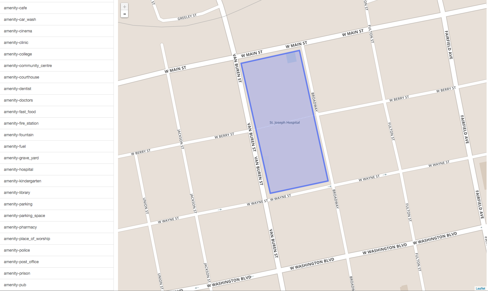

Visualizing Location of Ways
======

To view the perimiter of each way and its location you can use a simple webpage in: visualize_ways_map/waysmapview.html.


## Folder structure


```
download_ways/
  download_ways/			--> contains script to download ways data
    all_ways_features 		--> a list of all the way categories that can be used
    features.csv			--> a list of way categories to be used for download_ways.rb script
    download_ways.rb	
    training_data/			--> can be empty. For running the download_ways.rb script
  data/		        
  	less1000/				--> stores JSONs for categories with more than 1000 ways in the U.S. 
  	more1000/				--> stores JSONs for categories with less than 1000 ways in the U.S. 
  visualize_ways_map/		        
  	L.Map.Deflate.js				
  	waysmapview.html		--> map to view locations and perimiter of ways
```


## What you need
* The way JSON files (the data) must be in a folder called "data/more1000".
* Run a server from the root directory (from download_ways). If not, the map page won't be able to access the "data/more1000" folder. 
* Just zoom out the map the first time you load the page

<br>

<br><br>
